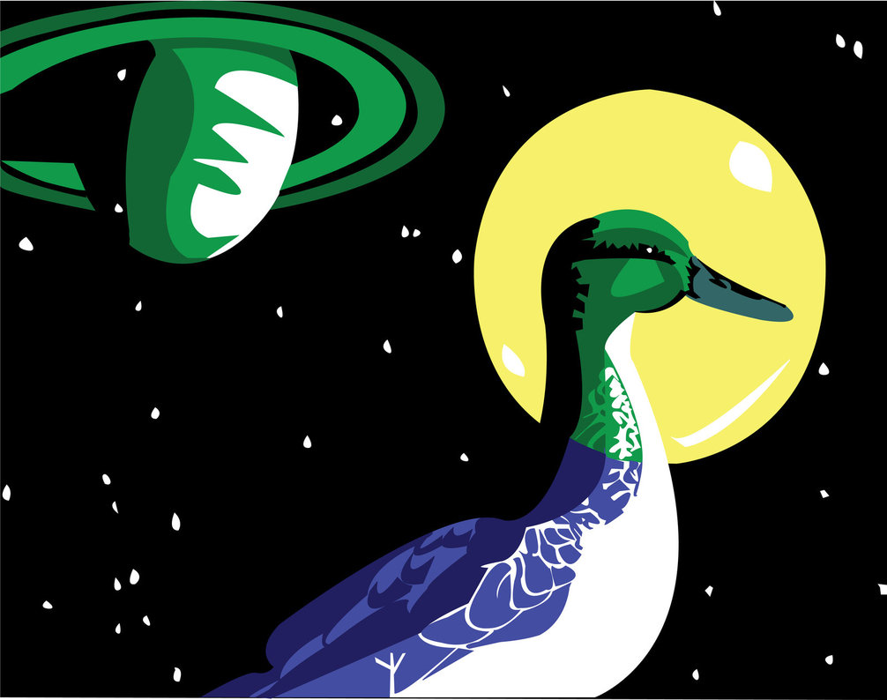
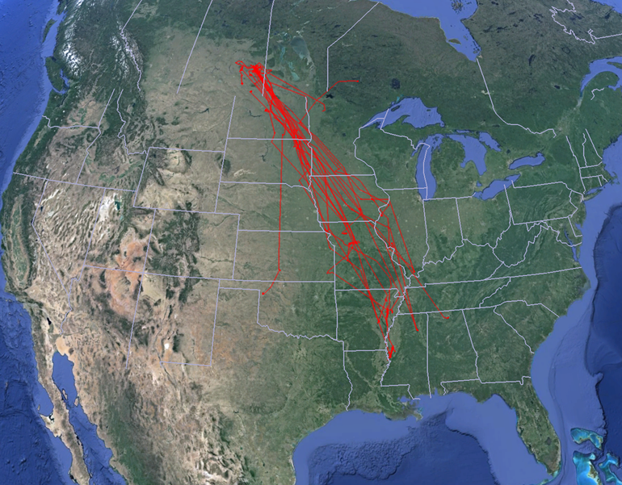
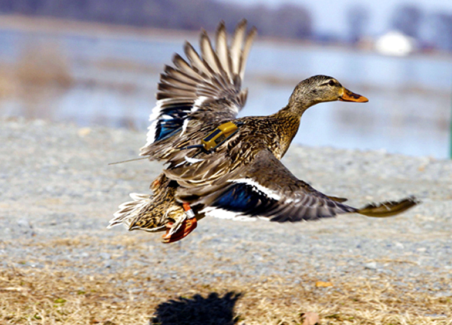
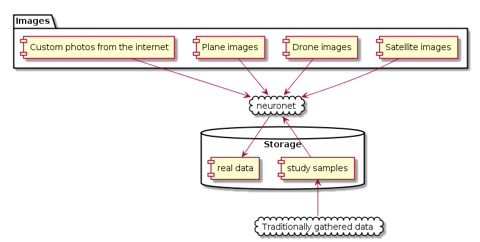
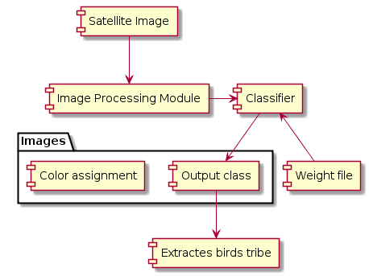

#HSLIDE
# duck and cover 

by (Kostya, Timur, NatashaL, NatashaTs, NatashaKh)

#HSLIDE
# What do we do?
Birds migration automatic recognition from satellite images using machine learning tools.

#HSLIDE
# What problems do we solve?
- Remove human-duck direct interaction
- Reduse costs on birds migration tracking
- Improve researches quality by providing a larger amount of data

#HSLIDE
# How do we do it?

#HSLIDE
# How do we do it?

#HSLIDE
# What else can we do?

#HSLIDE

