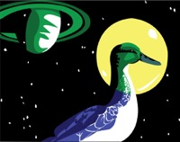
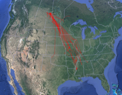
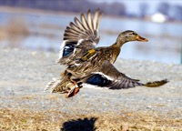

#HSLIDE
# duck and cover 

by (Kostya, Timur, NatashaL, NatashaTs, NatashaKh)

#HSLIDE
# What do we do?
Birds migration automatic recognition from satellite images using machine learning tools.

#HSLIDE
# What problems do we solve?
- Remove human-duck direct interaction
- Reduse costs on birds migration tracking
- Improve researches quality by providing a larger amount of data

#HSLIDE
# How do we do it?

#HSLIDE
# How do we do it?

#HSLIDE
# The data
- Satellite images
- Drone images
- Plane images
- Custom photos from the internet

All images have to be layer-stacked, georectified and when covering the same spatial subset have been co-registered to each other.

#HSLIDE
# What else can we do?
- Recognise fish migration
- Recognise hoofed animals migration
- Track refugees and illegal immigrants movements

#HSLIDE

